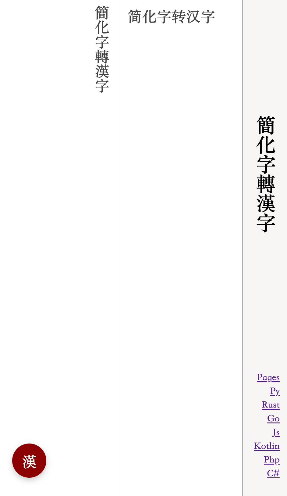
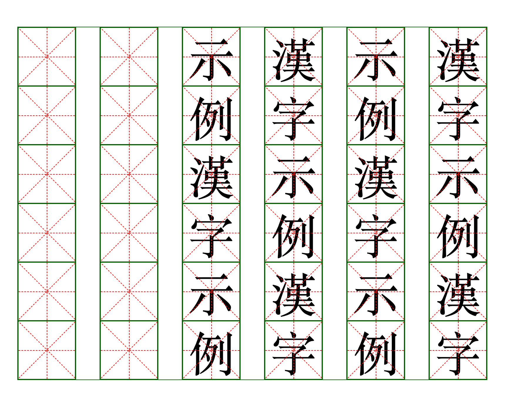

## 漢字

* [簡化字轉漢字](https://lizongying.github.io/hanzi/)
* [漢字網頁排版](https://lizongying.github.io/hanzi/zi.html)




## 簡化字轉漢字

* 支持《通用規範漢字表》中的全部簡化字
* 對於一對多的簡化字，人工標註規則
* 支持運行時增加自定義規則
* 簡單快速

[python](https://github.com/lizongying/pyhan)

## 漢字網頁排版

支持文字豎向排列，支持米字格底紋

* 橫向/豎向
* 米字格

配置：

* boxSize = '100px', // 暫時不用設置，默認會根據container的寬高和columnNum自動設置
* borderSize = '1px', // 可不用設置
* borderSizeBold = '2px', // 可不用設置
* fontSize = '80px', // 暫時不用設置，默認會設置為boxSize的4/5
* fontFamily = 'serif', // 可以設置
* borderColorOut = 'darkgreen', // 可以設置
* borderColorIn = 'red', // 可以設置
* mode = 'V', // 'V/H' 漢字排列方向。推薦設置
* count = 80, // 默認生成多少個漢字底紋，如果不設置會根據要展示的漢字數量自動添加。推薦設置
* columnNum = 8, // 每一行多少個漢字。推薦設置
* selector = '#container' // 顯示漢字的容器，如果不指定，會自動創建一個。強烈推薦設置

```html
<!DOCTYPE html>
<html lang="zh-Hant">
<head>
    <meta charset="UTF-8">
    <meta name="viewport" content="width=device-width, initial-scale=1.0">
    <title>漢字示例</title>
    <style>
        .container {
            margin: 1em auto;
            width: 800px;
            height: 600px;
        }
    </style>
    <script src="./zi.js"></script>
    <script>
        window.addEventListener('DOMContentLoaded', () => {
            const config = {
                mode: 'V',
                columnNum: 6,
                count: 48,
            }
            const zi = new Zi('.container', config);
            zi.show('漢字示例漢字示例漢字示例漢字示例漢字示例漢字示例')
        })
    </script>
</head>
<body>
<h1>漢字示例</h1>
<div class="container"></div>
</body>
</html>
```